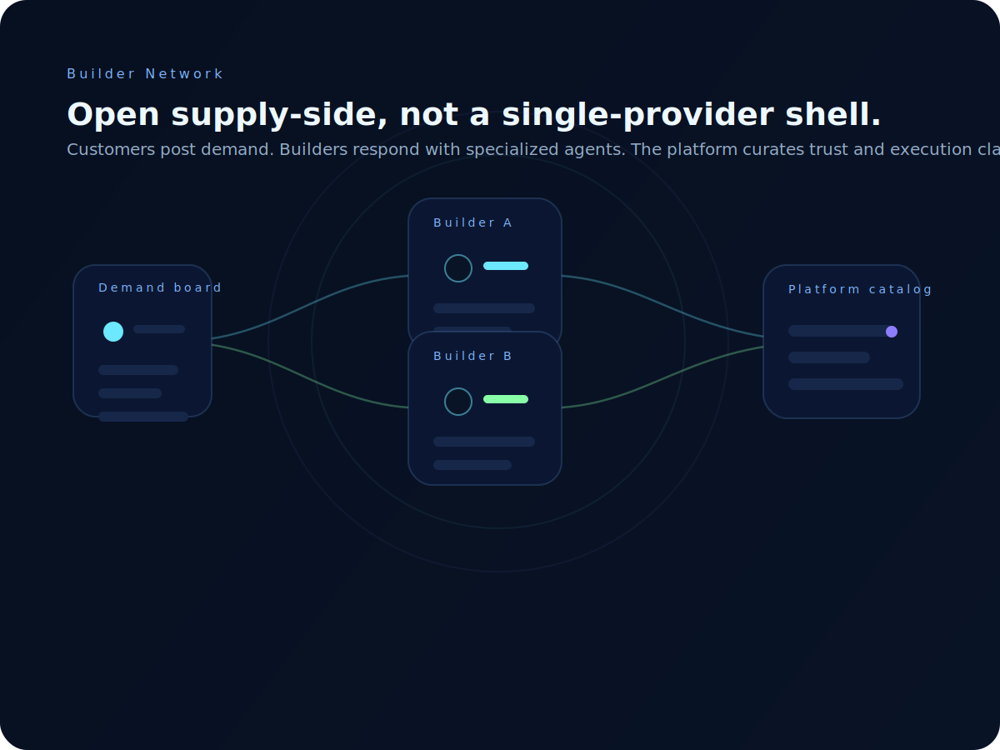
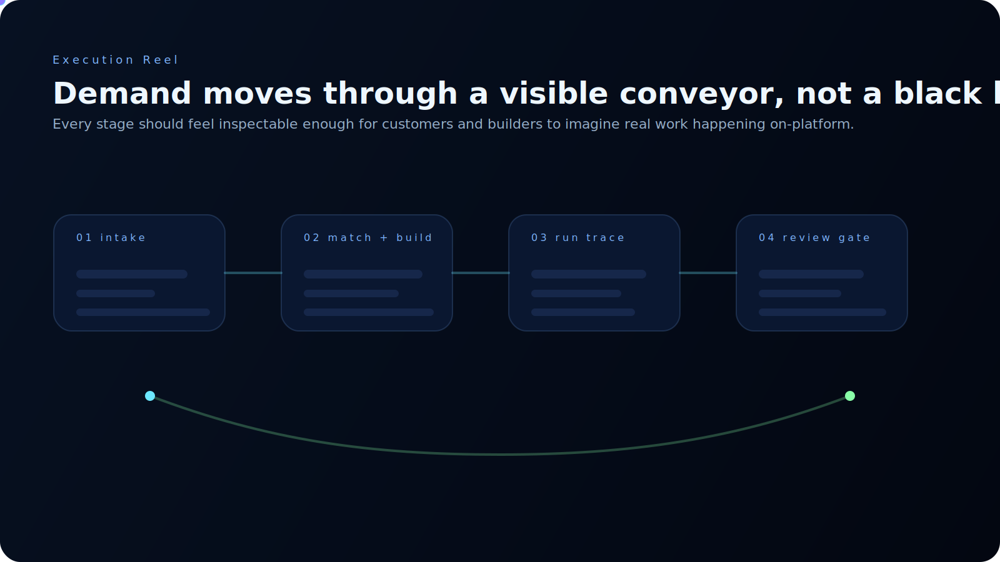
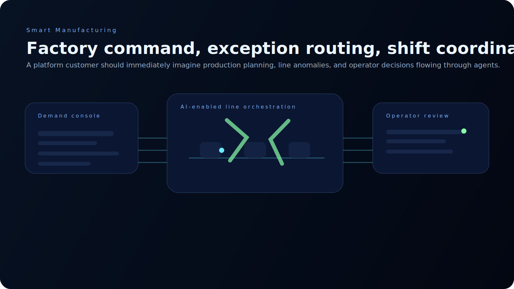
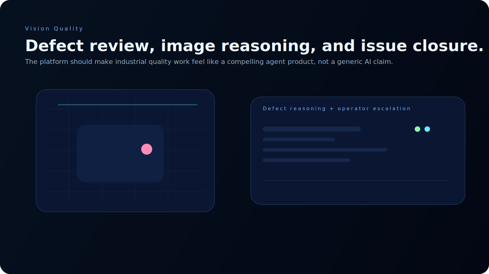
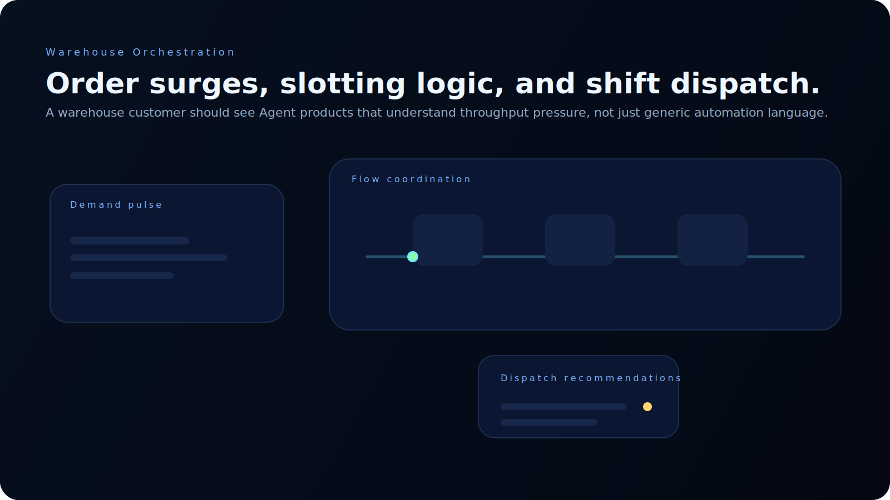
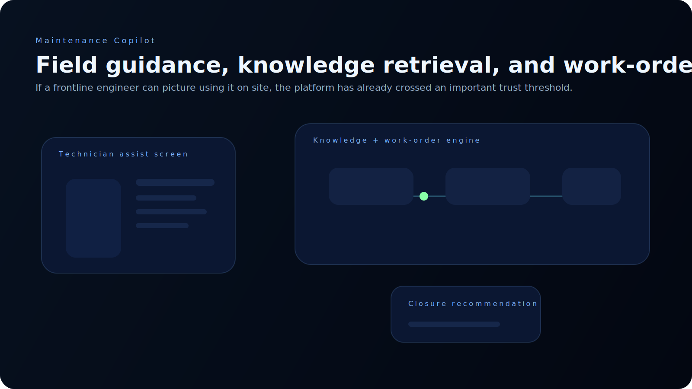

# Agora - AI Agent Platform

Open-source MVP for an AI Agent marketplace, delivery workspace, and operating control layer.

Chinese shorthand: `AI Agent 平台`

## Visual Preview



Agora is being shaped as a customer-demand + builder-supply platform, not just a static agent catalog.



The launch cohort starts with seeded first-party supply, but the long-term platform shape is open to outside agent developers and companies.



The newest product slice adds a live demand board publishing path and builder response layer, so the platform starts to behave like a market instead of a one-way showcase.

## Stage

MVP 2.0: executable monorepo with visible demand publishing, builder responses,
formal engagement objects, delivery operations, customer confirmation, feedback
and incident loops, and role-first operating surfaces.

## Stack

- `pnpm workspaces`
- `Turborepo`
- `Next.js 16`
- `Fastify`
- `PostgreSQL`
- `Prisma`

## Workspace

- `apps/web/`
- `apps/api/`
- `packages/shared/`
- `infra/`
- `docs/`

## Current Product Slice

- seeded four-agent catalog aligned to Athena, Hermes, Hephaestus, and Themis
- seeded builder/provider profile layer for the launch cohort
- live demand board publishing flow
- builder response layer
- shortlist / accept / decline workflow on builder responses
- single-accept response guard with engagement sync
- customer response-activity view
- builder-side active engagement visibility
- bilingual Chinese / English product experience
- industry showcase visuals for manufacturing, quality, warehouse, and maintenance scenarios
- agent catalog
- agent detail
- task intake
- persisted task requests
- first run record lifecycle
- first operator review flow
- operator queue
- ops-side response-decision queue
- provenance visibility for seeded agents
- result payload display
- queue filters for review state and status
- editable engagement workspace for milestones, deliverables, and commercial frame
- first-class customer confirmation on engagements
- first-class feedback and incident loops on engagements
- delivery runs created after response acceptance instead of at demand submission
- operating metrics across homepage, customer, builder, ops, provider, and engagement surfaces

## Newest Direction

- `Demand Board`: customer demand is visible to the builder side instead of staying trapped inside one catalog route
- `Demand Publishing`: customers can now publish a new need into the board instead of relying only on seeded examples
- `Builder Responses`: providers can respond to concrete demand with an offer, approach, and timeline
- `Response Decisions`: the platform can now shortlist, accept, or decline builder responses instead of leaving them as static cards
- `Engagement Workspace`: accepted responses now bootstrap a real delivery workspace that can be extended instead of an empty engagement shell
- `Post-Delivery Loop`: confirmation, feedback, and incidents now stay attached to the same engagement instead of being forced into a new demand workaround
- `Operating Intelligence`: the main role surfaces now expose delivery health, field pressure, and expansion signals
- `Role-first Views`: customer, builder, and ops pages now expose the signals each side actually cares about
- `Bilingual UX`: Chinese is now the default public-facing experience, with English preserved for parity
- `Industry-first Visuals`: the GitHub and web surfaces now share the same scene language across manufacturing, quality, warehouse, and maintenance workflows

## Product Scenes

### Smart Manufacturing



### Industrial Quality



### Warehouse Operations



### Field Maintenance



## Commands

```bash
pnpm install
pnpm --filter @agora/api prisma:generate
pnpm --filter @agora/api prisma:push
pnpm dev
pnpm lint
pnpm typecheck
pnpm db:export
pnpm db:import /path/to/dump.sql
```

## Read-Only Preview Mode

For a safer demo-only preview, use:

```bash
AGORA_PREVIEW_MODE=readonly NEXT_PUBLIC_AGORA_PREVIEW_MODE=readonly pnpm dev
```

In this mode:

- browsing stays enabled
- write actions are blocked at the API layer
- the UI shows a read-only preview banner and disables operator write controls

## Preview Helpers

```bash
./scripts/start-preview.sh interactive
./scripts/start-preview.sh readonly YOUR_PASSWORD
./scripts/start-public-preview.sh [PASSWORD]
./scripts/start-public-preview.sh interactive YOUR_PASSWORD
./scripts/check-public-preview.sh
./scripts/stop-public-preview.sh
./scripts/check-preview.sh
./scripts/stop-preview.sh
```

See:

- `docs/demo/local-preview.md`
- `docs/demo/public-demo-checklist.md`

## Local Database

- local PostgreSQL is the current development system of record
- API env file: `apps/api/.env`
- example env file: `apps/api/.env.example`

## License And Provenance

- This repository is licensed under `Apache-2.0`.
- Any imported third-party code or assets must have a clear compatible license and preserved attribution.
- No code from "no license" repositories should be copied into this project.
- See `THIRD_PARTY_CODE_POLICY.md`.
